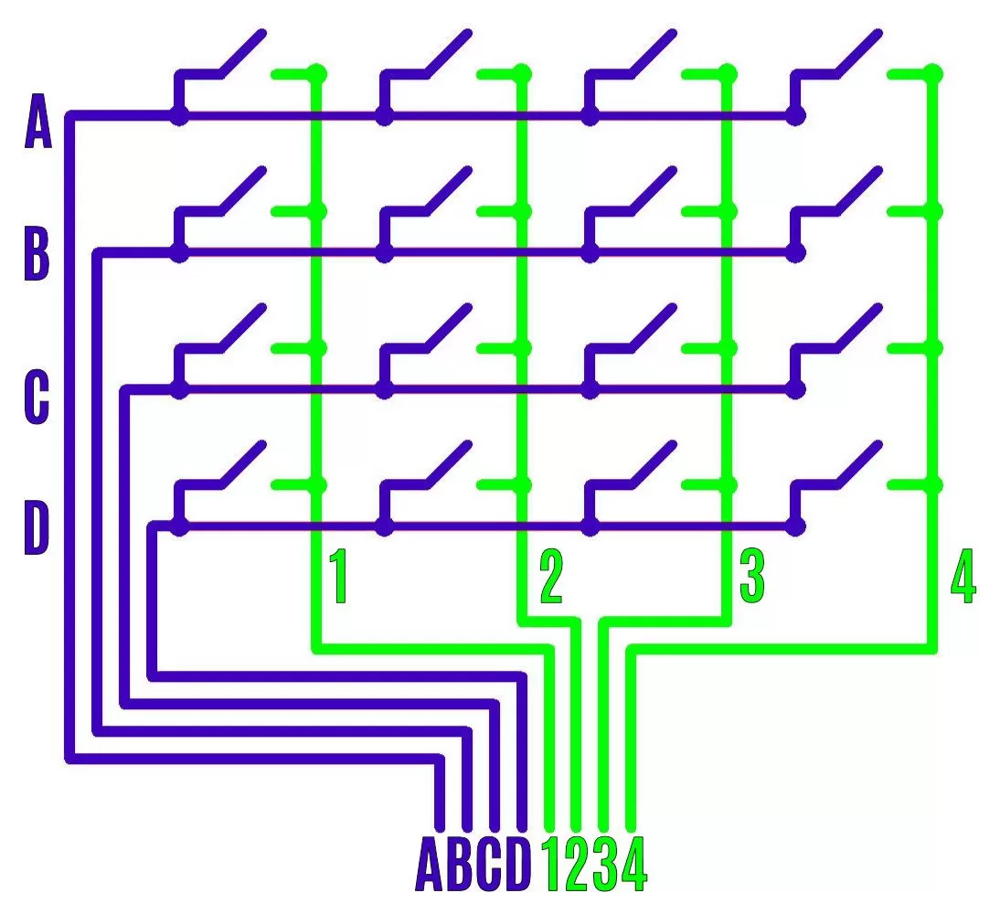
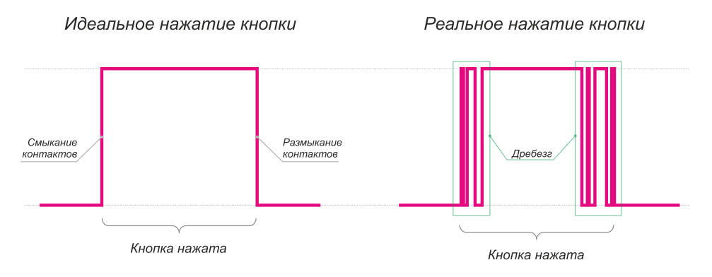

# Зачем нужна матрица кнопок?
Для экономии контактов (пинов). У нас есть 16 кнопок, соответственно, если бы мы подключали каждую кнопку отдельно, мы бы использовали 16 пинов Raspberry Pi. Если же мы сделаем из кнопок матрицу, нам нужно подключить только все строки (4) и столбцы (4) матрицы, соответственно, нам нужно всего лишь 8 пинов Raspberry Pi вместо 16, чтобы добиться того же результата.

# Как работает матрица кнопок?

Каждая из кнопок матрицы подключена одним выводом к одной из строк, а другим выводом к одному из столбцов. При нажатии на кнопку, ее контакты замыкают соответствующий этой кнопке столбец и строку. Так как оба этих контакта подключены к Raspberry Pi, мы можем отслеживать замыкание этих контактов. Зная какие столбцы и строки были замкнуты друг на друга, мы можем узнать, какая из кнопок была нажата. **Пока что может казаться, что принцип работы матрицы кнопок очень сложен, но после прочтения следующего пункта вы поймете, как работать с матрицей кнопок на практике, конкретными функциями библиотеки `RPi.GPIO`, а также сможете ознакомиться с наглядной симуляцией такой схемы.**

# Как узнать, какие кнопки матрицы нажаты?
Сконфигурируем пины Raspberry Pi, соответствующие строкам, как выводы при помощи функции
```python
GPIO.setup(row, GPIO.OUT)
```
столбцы сконфигурируем как вводы с подтяжкой вверх
```python
GPIO.setup(column, GPIO.IN, pull_up_down=GPIO.PUD_UP)
```
*Подтяжка вверх означает, что выводы Raspberry Pi подключены к 5V (высокий уровень) резистором. На практике это означает, что выводы Raspberry Pi по умолчанию всегда будут иметь логическую единицу, а логический ноль будет появляться на этих выводах только тогда, когда они подключены к земле. Наша кнопка как раз будет замыкать вводы с подтяжкой вверх на один из выбранных нами выводов (в зависимости от того, какую строку матрицы кнопок мы в данный момент опрашиваем), на котором установлен логический ноль. Подтягивающий резистор нужен для того, чтобы избавиться от электромагнитных помех, ведь когда кнопка не нажата, ввод Raspberry Pi "висит в воздухе" (то есть ни к чему не подключен, такое состояние часто называют **высокоимпедансным состоянием**), что может привести к "фантомным нажатиям" кнопки.*
Таким образом, по умолчанию столбцы будут иметь состояние логической единицы. Мы можем выбрать любую из строк и выставить на ней логический ноль функцией
```python
GPIO.output(row, GPIO.LOW)
```
Если одна из кнопок на этой строке нажата, то на соответствующем ей столбце появится логический ноль. Проверить это можно функцией
```python
GPIO.input(column)
```
После того как мы считали состояние кнопок на определенной строке, конечно же не забываем обратно установить на этой строке логическую единицу функцией
```python
GPIO.output(row, GPIO.HIGH)
```
иначе считывание состояния матрицы кнопок будет некорректным.
Повторяя алгоритм для других строк, мы можем построчно считать состояние всей матрицы, и любым образом обрабатывать нажатие кнопок в нашем коде. Или же можем просто установить на одной из строк (столбцов) логическую единицу, и пользоваться всего одной строкой (столбцом) матрицы, если в нашем коде нам не нужно больше 4 кнопок. Мы будем пользоваться этим "трюком" в меню игр, в играх арканоид и тетрис.
**Для более легкого понимания принципа работы, можете ознакомиться с [симуляцией работы матрицы кнопок](https://www.falstad.com/circuit/circuitjs.html?ctz=CQAgjCAMB0l3BWcMBMcUHYMGZIA4UA2ATmIxAUgpABZsKBTAWjDACgBnW7FcDQimF5h+UcCABmAQwA2HBpxCEEAkQJyrRVCNLkKueYpoFljYnbPmLWhPH1UoadtecmX94IffDFhW8bpWAB4gTCh4do4gmOR4EDTRCYBIIIDSIIBMIIB8IIAsICkAOhwASlIcAA4ARgwATpUAnvkACgCW+Uz5AOL1AJIA8tDyAC4AriUAFJUA9gDuADTtXb3dAKoAKgCUubkAdkmAXCCA3CCAciCA4iCAHCCAQiCAMiD5aenZLXM90OOD-SUvY1OzHB2PADLdAHV1ltAHggZ32x3OVw4N0yWXu33mTxeb36HxmD16AAlOm0sas2CFCDQIAR6GBcPRiJByAkokk4XlCsVylVag1mhxAIIg+UA-CDZM6AeRBAGwgOwygE4Qa5pQCsIIABEEAoiAbTY-XoDYYjADG4xkgwAtpsviroJ0AHJfN4yGQAfWGVoAJlNNrkAI5G+qLAAiVsW9WBm0AqCBcvYnfKQABqCKNjU2qM12r1m3WMLlgF4QaVnUNKwPB-IICMcVqIx7R2NanX6pMy2VpjMcdghfgJUTEGi8DDEWiJECAHBBAAwgZ1lJ0AYiC9-I7FMZfk7QmhFDEeh4LAgHjkIzxLuAfBAMhkjnLpVkJ9cIUde4LrrccvkiqUKtU6hwmkqQxwU73hSdADwgp7HE95O2fH4ZMK0oftcJxZOmFxfDsvY7Pkr5StkvaKls-KCmkeyCumXJnhwewZIAzCAnLuXL-pKL4ZHs0IjOGlb5IA7CC9mkJxcp+GRcmcz4ZLWZyERkSowTBuHjpOMHwW+-a9jO2AIM42B2AgNCqCSnZRAA0gAogAmmAmL5GAhC5CUCAzoQkDCNgHbttoraqQkmlaSgel1oZJSEDOeAIBAYA0NokAIOSdB2SADnYM5BlGUIM6sCgSA+d5K7gDQCR0vZ2k0OFrkUtJCDkCg4QUDQSAoNg67qdpCDhcQRkmSEMnkNgMmFUgjV2KlIXadVRbdPkaA1TlVBFVQCAILwRX0O1DkUs5KC6cZpnmdEpUgNZS0pV2DmGd1+nVW5HkBUt5L+cV2ACJN2kYFVkUoNFQgdiVCQUstJW0ht2l4FdJTZUSi2NbEkAJNgvnBVNkAzWDe0hJ5gNNWAkCEA18kg9prDg9dt1zsulngEDgO2edOlOdtHB9V92ALWNTggHgAO0F5yM6RlxOzUZ7lQ4ptA0OQcMkHTg1vTplXM3NUUhDFHbJdzuN8wzEXC5F5NcHQvCYLwXkqxgvDaG4eiKMoAiqytp3RJrriBB4hgG6bpgm1rATuNYBmRKbQhU4b2vm4oyvLngCTqz7CQew7XD6wHRsCPJgf27rBhGGHNuR2bweeLYYeu3YidBzH3BjXH-s0HHWdWCHKi0HHGhlwIRcW3HBcmKIddJ9nNhtXH6eV03xeeBrwi+LbnceDFad95n0dd0PjdgH3jfV2wkw5x3U+51Xc8L4nS9h5Aq-e4bG-u9vPDeBvLhbwA5t33jEt4VBnxfidX6Pt9D4bV-u1AbDnxPcdXzP7-z97LgAF9y3v-Q+G9Q4bxAUoUuLgIHANXnA3glsfBa1Xsglw6D4Hz0wcIJ2KC-4p2cKIFu+CoHtxcBSMy18D49wXuEOwUCd4RGgQbZhUDQ4v1LvQghHDmHIO4VA-hpt+FsLQXHbhJCBGr0kS7PBUj57t13qdKg+8FGOAzr7HGVDM7SPUYvZRHcyEGPXgYme0iDFKO0ZooxVCKEWNNlAm2u98DO1QfPG2FCXHUPcaIdeXidE+LOm3LxZiFFeM8cw1RyBIku38dY6RcTHohMLqvCuhs8CHyiRXDBYCtCpONonDJvAAnhw7kUwxaDckCHKVEmpwjD4lPKYUw+oTBB+AELlMwUD-aG06f3bpXhE59JKfnPODcUnzz6S4PpUSZmm2GfEyZvjNF9Nad7RO3tfI3xobQOALDdnbPnqHe+pctk8NOXs5BZzBFx0KbXPZNyzp7JIdc6ReD154NeaA5eC9-aMMPv7UOfyEGnO-qXYFRzwVeGQRC6mtc44wq8I8tphCUVkM+W3PBsLymN3KX0shyTVBePxeYqhk8DEkqWUEjpogSXdAoKIBGatRCa21lvSoDKaVnSvvi5AcA2AFFoDyhuAL-CDWGmIG+0ATJUs5XKplBC8WiHKQqregrWXyuYby8V1Ab5QGlWwDlSr1BoDlX5fl9KVX1LbKaiABKtXEK8aqgVIAbZ9JbH7MVuzdWSoNRyuGDr65cvMPANg9KA12AVRGlatqCGUOGsQgxzrBXtymbNYNergZID1TAEy-qKXEL0byuGFqtFUCjQYjVdq2BlCSvgV1EcgYUGNlvEIik7BYHoIQAqWAzpdhVLmDykAIBYASBEEdS52oDo4GzZARAVpLlYFPFaNNgrTtFjjRaWA4qWSQFgNq-b5j6XJiEJgxBnAZNCHFPAfaojrtnWeyIBAr3RE8muo9dZiAzjPQ1ecoRAa10PT0XqrbQh53hqEeglAJZAZ6iTess5iAQAQH3AyftiBIHakkLk0o+QnBTEyXksoMgpkAMIgH45QZDSL2AjfJ+LcnlCBXDHAABCABhAAsjWyDtMWAR3rWZbN3GSQdOSnW1cCN34hFbKuFD1Nn1GDGl2bDzHeT4cI8RsjFHiPUdoxwfk+QuSMYo-kdjXGgA)**

# Как обрабатывать нажатие и отпускание кнопки?
(переписать эту секцию)
Если мы постоянно опрашиваем состояние кнопок в бесконечном цикле, у нас появляется небольшая проблема: если кнопка нажата в течении долгого времени, каждая итерация цикла будет вовращать нам эту кнопку. Допустим, что после логики опроса кнопок, мы написали еще какой нибудь код, который непосредственно реагирует на нажатие кнопки, и что нибудь делает. Этот код будет постоянно выполняться, как будто мы заново нажимаем кнопку каждую итерацию цикла. А иногда нам хочется обрабатывать кнопку не каждую итерацию цикла, а только один раз при нажатии и отпускании кнопки. Для этого можно ввести какой нибудь флаг `waitForRelease` ("ожидание отпускания"), который будет установлен

Пример кода: `singlebuttonpressrelease.py`

# Дребезг контактов

К сожалению, при работе с кнопками, нам приходится сталкиваться с такой неприятной особенностью, как дребезг контактов. Конечно же, нам хотелось бы, чтобы кнопка выдавала ровный сигнал (логический ноль если кнопка нажата и логическую единицу если кнопка отпущена), но, к сожалению, в мире нет ничего идеального. Поэтому, при нажатии, контакты кнопки начинают дребезжать, и на доли секунды давать нам "грязный" сигнал, постоянно меняя сигнал то на высокий уровень, то на низкий, прежде чем стабилизироваться на одном из уровней, в зависимости от того, нажата ли кнопка. Для человека этот промежуток времени ничтожно мал, но вот компьютер, который может выполнять миллионы операций в секунду, отчетливо видит эти изменения высокого и низкого уровня. Соответственно, наша Raspberry Pi воспринимает дребезг контактов так, как будто мы за считанные миллисекунды несколько раз нажали и отпустили кнопку. Конечно же, это не так. Для того, чтобы бороться с данной неприятной особенностью, мы можем использовать встроенную в библиотеку RPi.GPIO возможность добавлять события на нажатие кнопки:
```python
GPIO.add_event_detect(pin, edge, callback, bouncetime)
```
Данная функция позволяет создать событие, которое будет вызывать переданную функцию `callback`, если на пине `pin` будет замечено изменение уровня `edge`.
`edge` может быть:
`GPIO.RISING` (рост) - изменение низкого уровня на высокое, срабатывает, когда кнопку отпускают.
`GPIO.FALLING` (падение) - изменение высокого уровня на низкое, может быть использовано для обработки нажатия кнопки.
Или `GPIO.BOTH` ("оба") - любое изменение уровня (рост или падение), срабатывает при любом изменении состояния кнопки.
Также функция позволяет передать `bouncetime` в миллисекундах - при изменении уровня, в течении этого времени, изменение уровня на обратное будет проигнорировано.


Также, простой антидребезг можно написать и самому, нужно всего лишь в течении небольшого времени (например, 200 миллисекунд) просто игнорировать все изменения состояния кнопки. Чтобы не останавливать выполнение кода на целых 0.2 секунды при помощи `time.sleep(0.2)` ради одной кнопки, используем возможность модуля `threading` под названием `Timer`. `Timer` позволяет нам создать таймер со временем `bouncetime`, по истечению которого в отдельном потоке вызовется нужная нам функция `function`.
```python
import threading
debouncetimer = threading.Timer(bouncetime, function)
debouncetimer.start()
```
или же можно записать таймер в одну строчку, чтобы не создавать лишнюю переменную:
```python
threading.Timer(bouncetime, function).start()
```
Внутри функции function будем устанавливать флаг `debounce`
```python
def function():
    global debounce
    debounce = True
```
А в алгоритме проверки состояния кнопок просто будем игнорировать любые изменения кнопки, пока флаг `debounce` не установлен в `True`. Таким образом, в течении времени `bouncetime`, пока кнопка дребезжит, все изменения состояния кнопки будут проигнорированы.
Пример кода: `singlebuttonpressrelease_debounce.py`

### Побочный эффект борьбы с дребезгом контактов
Так как в течении некоторого времени `bouncetime` мы игнорируем любые изменения состояния кнопки, то есть не только дребезг контактов, но и реальное отжатие кнопки пользователем, у кнопки появляется минимальное время, в течении которого она может быть нажата. То есть, если пользователь нажмет и отпустит кнопку меньше, чем за время `bouncetime`, то состояние кнопки обновится только через время `bouncetime`. Поэтому не рекомендуем ставить `bouncetime` больше, чем 200-300 миллисекунд. Как правило, контакты кнопки не дребезжат в течении большего времени, поэтому смысла ставить больше нет.

# Добавить секцию про гостинг когда/если добавим в схему диоды
https://deskthority.net/wiki/Rollover,_blocking_and_ghosting